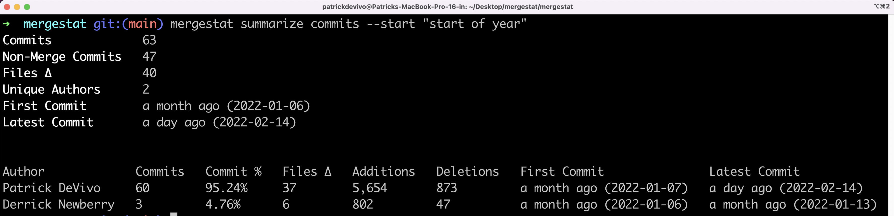
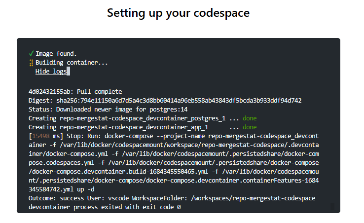
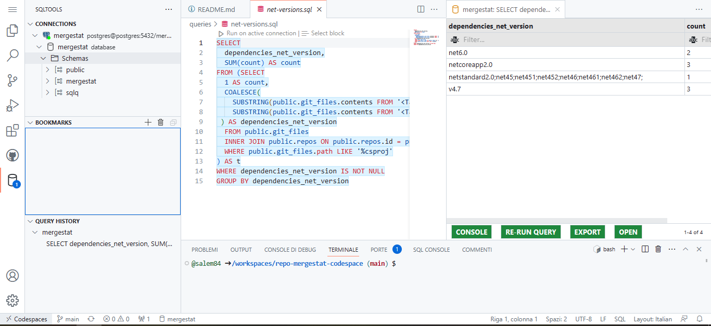

# Boost Your Repository Insights with GitHub Actions 🚀, Codespace 💻 and Mergestat 🔎📙

## Quickstart
1. Fork this repository
1. Change repositories URL and configuration in `config.json`
1. Execute `Run Analysis` workflow or alternatively configure it for scheduled execution or event-triggered execution
1. Create your GitHub Codespace: it will be automatically configured with all the necessary tools
1. Open an existing SQL query or create your own and execute it directly within Codespace.

## TL;DR

### Intro

#### What I built 
I have developed a solution that enables easy integration of the [Mergestat](https://www.mergestat.com/) within GitHub Codespace. With this integration, users can now seamlessly utilize Mergestat to analyze and track GitHub repositories using SQL queries, without needing to install any tools.
Furthermore, by leveraging GitHub Actions workflows, all the needed data can be collected automatically using scheduled workflows, thereby reducing information gathering times.

#### Category Submission: 
__Maintainer Must-Haves:__ Make the lives of Open Source maintainers easier.
> _Guidance:_ Developers can use Codespaces to set up an environment to triage issues and review pull requests. Actions can also be used to build tools and resources to help developers create better documentation.

#### Permissive License 
[MIT License](https://github.com/salem84/repo-mergestat-codespace/blob/main/LICENSE)

#### Background (What made you decide to build this particular app? What inspired you?) 
My objective in developing these extensions was to create a simple and efficient system for analyzing repositories, which can be easily implemented within one's own GitHub organization. By doing so, users can benefit from quick and accurate insights into their repositories, streamlining their development process and improving overall productivity using open-source tools.

#### How I built it (How did you utilize GitHub Actions or GitHub Codespaces? Did you learn something new along the way? Pick up a new skill?) 

To build this solution, I utilized both GitHub Actions and GitHub Codespaces. Specifically, I created a custom GitHub Actions workflow for data collection, and I configured a GitHub Codespace to execute queries. Along the way, I learned a lot about both tools and discovered new ways to use GitHub Actions in contexts outside of traditional CI/CD pipelines. Moreover, diving into the world of GitHub Codespaces was an eye-opening experience that allowed me to gain a deeper understanding of the platform's capabilities. In my upcoming detailed post, I'll share screenshots and code to describe each step of the process in more detail.

#### What is MergeStat
MergeStat is a powerful tool that allows developers to track and analyze data in git repositories and related sources (such as the GitHub API). 
Using MergeStat, users can gain valuable insights into their codebase and monitor key metrics using SQL queries to extract relevant data from GitHub repositories, and presents the information also in a user-friendly dashboard, making it easy for developers to identify and address issues in their code. 

It comes in two different modes:
- _Mergestat Lite_
- _Mergestat (Full)_

The main difference between the two is that Mergestat Lite is a fast and lightweight local command line tool that uses SQL queries and SQLite to analyze Git repositories. It doesn't load data into a SQLite database file but fetches data directly from the source (like Git repositories on disk) as queries run. This makes it great for analyzing small repositories quickly, but it might not be the best option for larger ones. 

On the other hand, Mergestat Full has a worker process that analyzes the repository and syncs the collected data into a PostgreSQL database. This mode provides a more robust and scalable solution for collecting data from larger repositories and analyze it at a later stage.

Although my initial plan for [#GitHubHack23](https://dev.to/devteam/announcing-the-github-dev-2023-hackathon-4ocn) challenge was to use Mergestat Lite to analyze the repository where the workflow was launched, perform the analysis and create an issue via the GitHub API to summarize all the information collected using the `mergestat summarize commits` [command](https://docs.mergestat.com/mergestat-lite/usage/summarize-commits):



I eventually chose to pursue a more complex solution!
Despite being more challenging, I believed that this approach would be more versatile and capable of fully utilizing the potential of the tools available on GitHub 💪! 

In the end, I decided to build a GitHub Action workflow that launch mergestat docker containers to analyze the repository, store the results in a PostgreSQL database and export it as workflow artifact.

### Workflow implementation
The workflow itself was not complex and used standard GitHub Actions.
  
```yaml
jobs:
  start:
    runs-on: ubuntu-latest
    steps:
      - name: Checkout
        uses: actions/checkout@v3

      - name: Start containers
        run: docker-compose -f "docker-compose.yaml" up -d
        working-directory: scripts/ci

      - name: Setup node
        uses: actions/setup-node@v3
        with:
          node-version: 16.13.x
          cache: npm
          cache-dependency-path: scripts/ci/package-lock.json

      - name: Install
        run: npm ci
        working-directory: scripts/ci
        
      - name: Run script
        run: npm start -- ../../config.json http://localhost:5433/graphql
        working-directory: scripts/ci

      - name: Postgres Dump
        run: |
          docker exec -i postgres pg_dump -U postgres -Fc -Z 9 postgres > backup_mergestat.dump

      - uses: actions/upload-artifact@v3
        with:
          name: pg-dump
          path: 'scripts/ci/backup_mergestat.dump'
        
      - name: Stop containers
        if: always()
        run: docker-compose -f "docker-compose.yaml" down
        working-directory: scripts/ci
```

The only challenging part was finding a way to instruct Mergestat to index the selected repositories using the command line, as it is normally done via the UI. 

Let's take it step by step.

#### Startup containers and install requirements

The first step is to download the source code and start all the required containers for mergestat using docker compose. To do this, I used the YAML script available on the mergestat website, removed the container for the graphical interface, and, most importantly, simplified the authentication process towards the GraphQL API by modifying the default_role of the _Graphile Engine_. This way, all API calls, even those not authenticated, will use the admin role, and it will be possible to bypass the authentication call... There might have been other ways, but for the project's purposes, this seemed to be the quickest and safest approach.

I had also started to figure out how to apply [GitHub Services Container](https://docs.github.com/en/actions/using-containerized-services/about-service-containers) instead of `docker compose` to run PostgreSQL and the worker, but from what I've seen it's not (yet) possible to start a service container (in our case, the worker) only when another container (in our case, PostgreSQL) is ready.

After that, I set up the environment for _Node.js_, installed the necessary packages, and started compiling the _TypeScript_ scripts.

#### Preparation script to indexing repository

For the writing of this script, I had mainly two options: either to understand the internal details of the database and write the appropriate SQL queries to insert the data, or alternatively, to use the same APIs that are used by the web portal.

In the end, I chose the second option and to speed up the process, I partly analyzed the calls made to the GraphQL endpoint using browser developer tools, and partly studied the code, reusing useful portions such as the schema, queries, and mutations. I also made extensive use of Codespaces to have a ready-to-use environment when needed to spin up all needed tools.

```ts
async function main() {
  let configPath = process.argv[2];

  if(!configPath) {
    console.error('ConfigPath is not valid: ' + configPath);
    process.exit(1);
  }
  console.log(configPath);
  const config : ConfigRoot = ConfigReader.read(configPath);

  let endpoint = process.argv[3];
  console.log('Endpoint: ' + endpoint);
  if(!endpoint) {
    endpoint = defaultEndpoint;
  }
  graphQLClient= new GraphQLClient(endpoint);

  await create(config.repositories);
  
  let syncCompleted = false;
  const total = config.repositories.length;
  do {
    const status = await getReposStatus();
    console.log(status);
    console.log('Wait completing count repositories: ' + total);
    syncCompleted = await checkSyncCompleted(status, total);
    await sleep(5000);
  }
  while(!syncCompleted)
}
```

The script is quite long, which is why you won't find it all in this article, but it is of course available on the [GitHub repository](https://github.com/salem84/repo-mergestat-codespace/tree/main/scripts/ci).

I don't write much Typescript code in general (I mainly work on .NET projects), but apart from the initial configuration of the compilation scripts using `ts-node`, the rest went smoothly and it's just simple query and mutation GraphQL calls... actually, it was a great opportunity for me to deepen my knowledge of GraphQL with a different technology stack.

To make the script configurable, a JSON configuration file is read, such as:

```json
{
    "repositories": [
        {
            "url": "https://github.com/salem84/AspNetCore.VersionInfo",
            "syncs": [ "Git Commits", "Git Files" ]
        },
        {
            "url": "https://github.com/xmasdev-2022/xmaze-api",
            "syncs": [ "Git Files"]
        } 
    ]
}
```

where there is:
- `url`: repository absolute URL
- `syncs`: an array with the names of the synchronization types to enable on the repository ([here](https://docs.mergestat.com/mergestat/setup/github-authentication#sync-types) you can find other types)

However, I would like to integrate in the next few days the association of a _GitHub Personal Access Token (PAT)_ to enable all possible types of indexing 💡.

#### Workflow final steps
The last step is to export the database and upload it as an artifact on GitHub. In this case too, there were many ways to perform the dump... from using GitHub Actions available on the Marketplace or using command line and exporting plain scripts or gzip compressed tarballs. I chose to use pg_dump which is directly available inside the PostgreSQL container and export a dump in custom archive compressed mode.

```
docker exec -i postgres pg_dump -U postgres -Fc -Z 9 postgres > backup_mergestat.dump
```
where:
- `-U`: username parameter
- `-Fc`: custom archive output
- `-Z 9`: maximum compression

In conclusion, we upload the artifact to GitHub and shut down all the containers.

### What is GitHub Codespaces?
GitHub Codespaces provides developers with a cloud-based development environment, allowing for faster onboarding, coding on any device, and maintaining consistency across environments. Its user interface resembles popular IDEs such as Visual Studio Code, but it operates directly within your web browser. To tailor your project to GitHub Codespaces, you can create custom configuration files that ensure a consistent setup for all project users.

#### Starting with DevContainers
The first thing we're going to configure is **DevContainers** feature. What is it?

DevContainers is a feature of Visual Studio Code that allows you to define and configure containerized development environments. With DevContainers, you can specify all the dependencies, tools, and settings required for the development environment within a configuration file, known as `devcontainer.json`. 
When you open Codespace with DevContainers configuration, it automatically starts a Docker container with all the preconfigured necessary resources, providing a consistent and isolated development environment. 
This is particularly useful for ensuring that all team members have the same configuration and dependencies, facilitating collaboration and quick project startup.


In our case, I have created a `devcontainer.json` file inside the `.devcontainer` folder with the following configuration:

```json
{
  "name": "Mergestat Codespace Project",
  "dockerComposeFile": "docker-compose.yml",
  "workspaceFolder": "/workspaces/${localWorkspaceFolderBasename}",
  "service": "app",
  "remoteUser": "vscode",
  
  // Configure tool-specific properties.
  "features": {
    "ghcr.io/devcontainers/features/github-cli:1": {}
  },
  "customizations": {
    "codespaces": {
      "openFiles": [
        "README.md"
      ]
    },
    "vscode": {
      "extensions": [
        "mtxr.sqltools",
        "mtxr.sqltools-driver-pg"
      ],
      "settings": {
        "sqltools.connections": [
          {
            "previewLimit": 50,
            "server": "postgres",
            "port": 5432,
            "driver": "PostgreSQL",
            "name": "mergestat",
            "database": "mergestat",
            "username": "postgres",
            "password": "postgres"
          }
        ]
      }
    }
  },

  // Use 'forwardPorts' to make a list of ports inside the container available locally.
  // This can be used to network with other containers or the host.
  "forwardPorts": [5432],

  "initializeCommand": ".devcontainer/init.sh",
  // Use 'postCreateCommand' to run commands after the container is created.
  "postCreateCommand": ".devcontainer/post-create.sh"
}
```

Let's analyze the individual sections of the file in detail:

- **name**: Specifies the name of the DevContainer configuration.
- **dockerFile**: Specifies the path to the Dockerfile/DockerCompose used to build the container image.
- **customizations"/codespaces/openFiles**: to open automatically the README file.
- **customizations/vscode/extensions**: Lists the Visual Studio Code extensions that should be installed.
- **customizations/vscode/settings**: Specifies custom Visual Studio Code settings that should be applied when working in the DevContainer. These settings can include editor preferences, formatting options, and more.
- **forwardPorts**: Lists the ports that should be forwarded in Codespace to test and debug your application. 

- **initializeCommand/postCreateCommand**: Specifies a command that should be executed when the Codespace is initialized and after the container is created. This is used to prepare the environment as explained in greater detail in the following sections.


#### Docker-compose configuration
In our docker-compose file, we currently have two containers:

1. The _"postgres"_ container: This container is responsible for starting the PostgreSQL database. It provides the necessary environment for running and managing the database.

1. The _"app"_ container: This is the main container, built from the Dockerfile. It installs the PostgreSQL tools and will be used to restore the database.



Additionally, in the _.devcontainer_ configuration, we privately expose port 5432 of the "postgres" container using "forwardPorts". This allows us to access the PostgreSQL database running inside the container from the local machine.


#### Features & VSCode Customization

With just a few lines of code, we can customize our environment in the following ways:
- Installing the GitHub CLI
- Installing VSCode extensions for interacting with the database
- Initializing the default database connection

#### Bash Scripts for Codespace Configuration

We have two scripts executed at different times. The first script, `init.sh`, is executed before initialization and simply creates the folder where the database will be stored. In reality, this step could be skipped, but it helped me understand the Codespace lifecycle better.

The second script `post-create.sh` is the more important one. It is executed after initialization and performs essential configurations and setup tasks to ensure the environment is fully prepared.

Let's analyze the script:

```sh
#!/bin/bash
workflow_name="Run Analysis"

echo "Get info on latest GitHub Actions run..."
run_id=$(gh run list -w "$workflow_name" -L 1 --json databaseId | jq '.[]| .databaseId')

echo "GitHub Actions latest runId: $run_id"

echo "Download artifacts..."
gh run download $run_id -D $(pwd)/pgdata
```

The first part retrieves the artifacts associated with the latest execution of the "Run Analysis" workflow using the GitHub CLI. The artifact is then deposited into a temporary folder.

---

```sh
echo "Starting database restore..."
touch ~/.pgpass
echo "postgres:5432:mergestat:postgres:postgres" > ~/.pgpass
chmod 0600 ~/.pgpass

pg_restore -h postgres -U postgres -d mergestat --clean -x --no-owner $(pwd)/pgdata/pg-dump/backup_mergestat.dump 
```


To ensure proper execution of the bash scripts, it is essential to grant the execution permissions using the `chmod +x` command. This command allows the scripts to be run as executable files and can be executed directly inside Codespace and then committed to repository.

Our Codespace will be:


